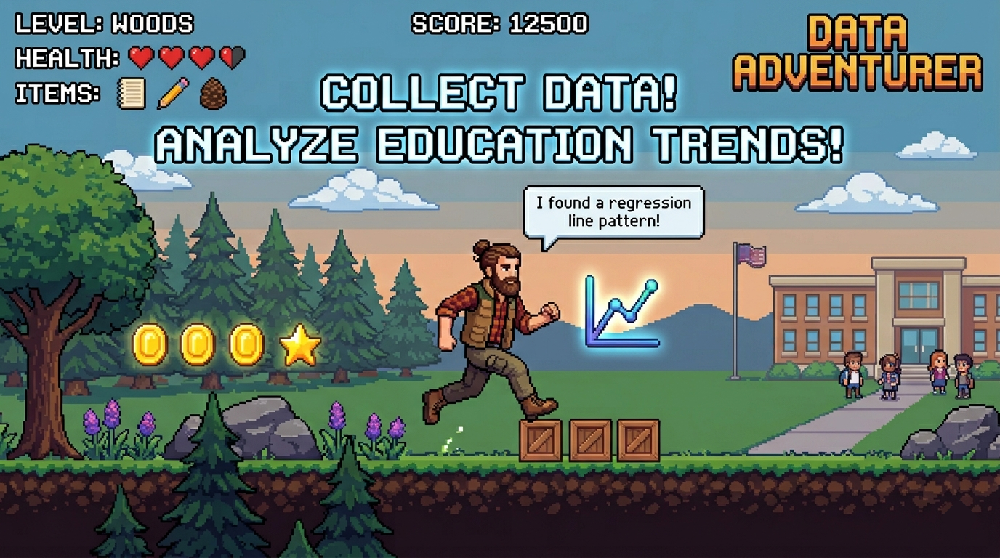

## Hi there! I'm Josiah Passe 👋

**EdTech Specialist | Aspiring Data Scientist | M.S. Candidate**

I am a seasoned data expert with a deep background in Education Technology. My passion lies in transforming messy school data into clear, actionable insights that support teachers, administrators, and—most importantly—students.

- **Current Focus:** Building data-informed frameworks for K-12 environments.
- **Education:** Currently pursuing an **M.S. in Data Science** at the **University of St. Thomas** (Saint Paul, MN).
- **Professional:** Currently working at **Timely**, focusing on enabling educators to leverage AI to build better master schedules.
- **Domain Expertise:** Student Information Systems (SIS), Educational Analytics, and K-12 Policy.

### Technical Toolkit
- **Programming & Data:** Python (Pandas, Scikit-learn), SQL (Microsoft SQL Server, PostgreSQL, Oracle)
- **Business Intelligence:** Tableau, Power BI, Seaborn/Matplotlib
- **Statistics**: Regressional Analysis, Permutation, Bootstrapping

### Current Projects
*I'm currently applying my graduate studies to real-world EdTech challenges, including:*
- Statistical simulations for regional educational trends.
- Budgeting and financial tool automation for small-scale educational organizations.
- Market Analysis of the EdTech industry, focusing on Student Information Systems.

---

### Let's Connect!
- [LinkedIn](https://www.linkedin.com/in/josiah-passe/)

*"Making data-informed decisions to advance K-12 Educators and Students."*
